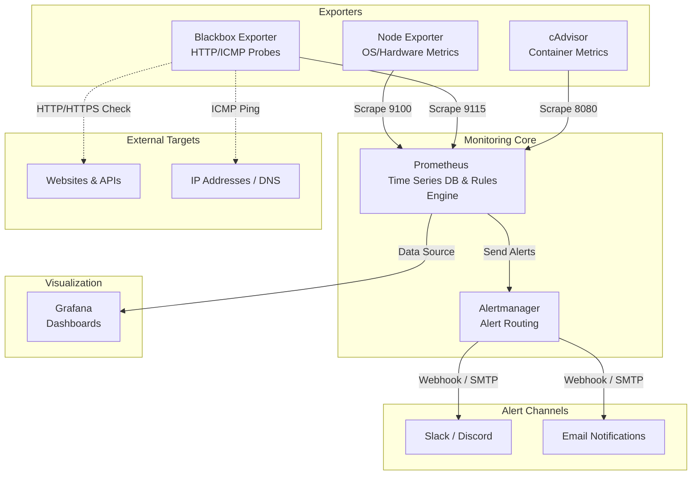

# Enterprise Network Monitoring & Alerting Stack


This repository showcases an end-to-end, fully automated observability platform that I designed using modern DevOps and System Administration practices. My goal was to build a robust, "Infrastructure as Code" (IaC) driven monitoring stack capable of tracking server metrics, network endpoints, and container resource usage, while actively alerting on critical system states.

## 🏗️ Architecture & Design

I structured this stack to follow enterprise zero-touch provisioning principles. The entire architecture runs on a dedicated Docker bridge network, ensuring isolation and security. 



## 🚀 Key Engineering Features

*   **Zero-Touch Provisioning:** I configured Grafana to automatically load Prometheus as a data source and import pre-configured, high-quality dashboards on startup. No manual UI configuration is required.
*   **Comprehensive Metrics Collection:**
    *   **Node Exporter:** Real-time tracking of CPU, Memory, Disk Space, and Network I/O on the host.
    *   **cAdvisor:** Deep visibility into Docker container resource usage and health.
    *   **Blackbox Exporter:** Uptime and latency monitoring for external web endpoints (HTTP/HTTPS) and ICMP (Ping) tests.
*   **Actionable Alerting Rules:** I wrote custom Prometheus alerting rules (`alerts.yml`) to detect anomalies such as High CPU usage (>80%), Low Memory, Disk Space exhaustion, and Endpoint Downtime.
*   **Centralized Alert Routing:** Alertmanager is configured to deduplicate, group, and route these alerts to external webhooks (e.g., Slack, Discord) and Email.

## 🏃‍♂️ Local Deployment & Testing

To test the architecture locally on your machine, ensure Docker and Docker Compose are installed. Then, simply execute the following command in the root directory:

```bash
docker-compose up -d
```

Once the stack is initialized, you can access the core services:

*   **Grafana:** [http://localhost:3000](http://localhost:3000) *(Username: admin / Password: admin)* - Dashboards are pre-loaded!
*   **Prometheus:** [http://localhost:9090](http://localhost:9090) *(Navigate to Status -> Targets to verify all endpoints are UP)*
*   **Alertmanager:** [http://localhost:9093](http://localhost:9093)

### Testing the Alerting Pipeline

To observe how the system handles failures, you can simulate an outage:
1. Stop one of the core metrics collectors: `docker stop node-exporter`
2. Wait approximately 1 minute. Prometheus will evaluate the `InstanceDown` rule.
3. Check the Prometheus UI (`/alerts`) to see the alert transition into the `FIRING` state.
4. (Optional) If you have configured a valid webhook in `alertmanager.yml`, you will receive a notification via your selected channel.
